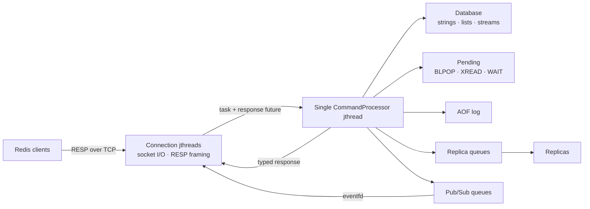

# Redis Clone in C++23

A Redis-compatible in-memory data store written from scratch in C++23.

The project was created while completing the [CodeCrafters Build Your Own Redis challenge](https://codecrafters.io/challenges/redis). It is an educational implementation focused on protocol design, concurrency, persistence, and replication—not a production replacement for Redis.

## Features

- RESP command parsing and response serialization compatible with `redis-cli`.
- Strings, lists, and streams stored in a single type-safe database.
- Lazy key expiration with second and millisecond precision.
- Transactions with `WATCH`-based optimistic concurrency control.
- Blocking list and stream operations without blocking the command processor.
- Channel-based Pub/Sub with asynchronous per-client delivery.
- Master-replica command propagation, acknowledgements, and `WAIT`.
- AOF persistence with manifest handling, configurable fsync, and startup replay.
- RDB loading for string values and expiration metadata.
- Password authentication for the default ACL user.
- Managed connection threads and graceful SIGINT/SIGTERM shutdown.

## Supported commands

| Area | Commands |
| --- | --- |
| Connection | `PING`, `ECHO` |
| Strings and keys | `SET`, `GET`, `INCR`, `KEYS *`, `TYPE` |
| Lists | `RPUSH`, `LPUSH`, `LRANGE`, `LLEN`, `LPOP`, `BLPOP` |
| Streams | `XADD`, `XRANGE`, `XREAD`, `XREAD BLOCK` |
| Transactions | `MULTI`, `EXEC`, `DISCARD`, `WATCH`, `UNWATCH` |
| Pub/Sub | `SUBSCRIBE`, `UNSUBSCRIBE`, `PUBLISH` |
| Authentication | `AUTH`, `ACL WHOAMI`, `ACL GETUSER`, `ACL SETUSER` |
| Replication and server | `INFO`, `CONFIG GET`, `REPLCONF`, `PSYNC`, `WAIT` |

Notable supported behavior includes:

- `SET` expiration through `EX` and `PX`.
- Positive and negative `LRANGE` indexes.
- Optional element counts for `LPOP`.
- Fractional and infinite timeouts for `BLPOP`.
- Explicit, automatic (`*`), and automatic-sequence stream IDs.
- Multi-stream and blocking `XREAD`, including the `$` starting position.
- Multiple watched keys and transaction aborts when their revisions change.
- Multiple Pub/Sub channels and multiple connected replicas.

### Command behavior

String commands return Redis-compatible null and wrong-type responses. `INCR` treats its value as a signed integer stored inside a string, while `SET` replaces any existing value and can attach an expiration.

Lists use `std::deque`, making pushes and pops efficient at both ends. `BLPOP` is handled by the processor rather than the database: when no value is available, the request is stored and retried after later commands or until its timeout expires.

Stream entries contain an ordered ID and a list of field-value pairs. `XRANGE` and `XREAD` use binary search over the ordered entries, and blocking `XREAD` follows the same pending-request model as `BLPOP`.

Transactions are associated with the client ID. Commands are queued after `MULTI`, then executed together by `EXEC`. Key revision numbers allow `WATCH` to detect modifications without keeping copies of database values.

Pub/Sub channels are transient routing state rather than database keys. Each client has a message queue, and an `eventfd` wakes its connection thread when the processor delivers a publication or subscription acknowledgement.

## Architecture

Socket I/O is concurrent, while command execution is serialized. Every connection owns a managed `std::jthread` that parses RESP input and submits commands to a single `CommandProcessor` worker. The worker owns mutable server state, so the database does not require internal locking.



### Request flow

1. `TcpServer` accepts a socket and starts a managed connection thread.
2. The connection buffers received bytes until the RESP parser produces a complete command.
3. The parsed command and client ID are submitted to the processor queue together with a response promise.
4. The processor checks authentication, transaction state, subscribed mode, and replica write restrictions.
5. A command handler validates its arguments and operates on the database.
6. Successful writes are persisted or replicated when those features are enabled.
7. The connection receives the typed response through its future, serializes it, and sends it to the client.

The processor also owns pending blocking commands. It retries them after later tasks and resolves them when data becomes available or a timeout expires, keeping the single worker available for unrelated clients.

Successful writes are serialized once and reused for AOF and replication where applicable.

### Thread lifecycle

Connection threads are owned by `TcpServer`, periodically joined after completion, and never detached. During shutdown, the server stops accepting connections, shuts down active sockets, cancels pending blocking operations, and joins every connection and replication thread before destroying the processor.

## Data model

The database uses one `std::unordered_map<std::string, Entry>`. Each entry contains a variant of:

- `std::string`
- `std::deque<std::string>`
- `std::vector<StreamEntry>`

Entries can carry a `std::chrono::steady_clock` expiration time. Expired values are removed lazily when accessed or while enumerating keys. A separate key-revision map supports `WATCH` and `EXEC` conflict detection.

## RESP protocol

Incoming commands are RESP arrays of bulk strings. The parser distinguishes complete commands, incomplete input, and malformed input, allowing a connection to retain partial frames and process multiple pipelined commands from one read.

Responses are represented by a `std::variant` containing simple strings, errors, integers, bulk strings, null values, and recursive arrays. The RESP layer is shared by client communication, AOF persistence, and replication.

## Persistence

When AOF is enabled, it takes precedence over RDB loading.

### Append-only file

- Creates the configured append-only directory when needed.
- Creates or reads a manifest to find the active incremental AOF file.
- Stores only successful modifying commands as RESP.
- Preserves transaction boundaries using `MULTI` and `EXEC`.
- Replays commands in order during startup.
- Supports `always`, `everysec`, and `no` fsync policies.

### RDB loading

- Loads the configured RDB file when AOF is disabled.
- Validates the RDB header and version field.
- Supports database 0 and string values.
- Reads ordinary and integer-encoded strings.
- Restores second- and millisecond-precision expiration metadata.
- Skips values that were already expired at startup.

The server reads RDB snapshots but does not generate them.

## Replication

Replication uses Redis-style `PING`/`REPLCONF`/`PSYNC` handshaking followed by an ordered stream of write commands.

- The master generates a 40-character replication ID and tracks a byte offset.
- Each downstream replica has a condition-variable-backed queue of shared immutable frames.
- Successful writes are normalized where necessary before propagation.
- Replicas execute received commands through the same processor used by local clients.
- Replicas acknowledge processed offsets in response to `REPLCONF GETACK *`.
- `WAIT` tracks the calling client's last write offset and counts replicas that reached it.
- Replica servers reject direct client writes with a `READONLY` error.

Full synchronization currently sends an empty RDB payload, so only writes performed after a replica connects are propagated.

## Building and running

### Requirements

- Linux or a compatible environment with POSIX sockets, `poll`, `pthread`, and `eventfd`
- A C++23 compiler
- CMake 3.13 or newer
- [vcpkg](https://github.com/microsoft/vcpkg) with `VCPKG_ROOT` configured

Start the server using the repository wrapper:

```sh
export VCPKG_ROOT=/path/to/vcpkg
./your_program.sh
```

The server listens on port `6379` by default:

```sh
redis-cli PING
redis-cli SET greeting hello
redis-cli GET greeting
```

To build manually:

```sh
cmake -B build -S . \
  -DCMAKE_TOOLCHAIN_FILE="$VCPKG_ROOT/scripts/buildsystems/vcpkg.cmake"
cmake --build build
./build/redis
```

## Configuration

| Flag | Default | Purpose |
| --- | --- | --- |
| `--port <port>` | `6379` | Client TCP port. |
| `--replicaof "<host> <port>"` | none | Starts the server as a replica. |
| `--requirepass <password>` | none | Protects the default user with a password. |
| `--dir <directory>` | working directory | Base directory for persistence files. |
| `--dbfilename <filename>` | `dump.rdb` | RDB filename. |
| `--appendonly yes\|no` | `no` | Enables AOF persistence. |
| `--appenddirname <directory>` | `appendonlydir` | AOF subdirectory. |
| `--appendfilename <filename>` | `appendonly.aof` | AOF base filename. |
| `--appendfsync always\|everysec\|no` | `everysec` | AOF synchronization policy. |

Examples:

```sh
./your_program.sh --requirepass secret
./your_program.sh --port 6380 --replicaof "127.0.0.1 6379"
./your_program.sh --dir /tmp/redis-data --appendonly yes --appendfsync everysec
```

## Project structure

| Component | Responsibility |
| --- | --- |
| `server.*` | Socket setup, connection workers, replication handshake, and shutdown. |
| `command_processor.*` | Task queue, dispatch, transactions, blocking commands, persistence, replication, and Pub/Sub routing. |
| `database.*` | Typed values, expiration, list and stream operations, and key revisions. |
| `resp.*` | Command parsing and response serialization. |
| `commands.*`, `rlist.*`, `rstream.*` | Command validation and type-specific behavior. |
| `aof.*`, `rdb.*` | Persistence file management and startup recovery. |
| `replication.*`, `pubsub.*` | Per-replica and per-subscriber delivery queues. |
| `server_config.*` | Command-line parsing and persistence path validation. |

## Limitations

- Command dispatch expects uppercase command names, as sent by `redis-cli`.
- Only logical database 0 is supported.
- `KEYS` supports only the `*` pattern.
- `BLPOP` accepts one key.
- ACL support is limited to the default user with fixed full permissions.
- RDB loading supports strings only and does not support LZF compression.
- Full replication synchronization does not transfer the master's existing dataset.
- Partial replication resynchronization is not implemented.
- Pub/Sub supports channels but not pattern subscriptions.
- Redis Cluster, Sentinel, Lua, modules, eviction policies, and TLS are outside the project scope.

## Testing

The implementation has been validated against the CodeCrafters test suite for all completed Redis stages. The tests cover command behavior, RESP encoding, expiration, lists, streams, blocking operations, transactions, persistence, replication, Pub/Sub, and authentication.
